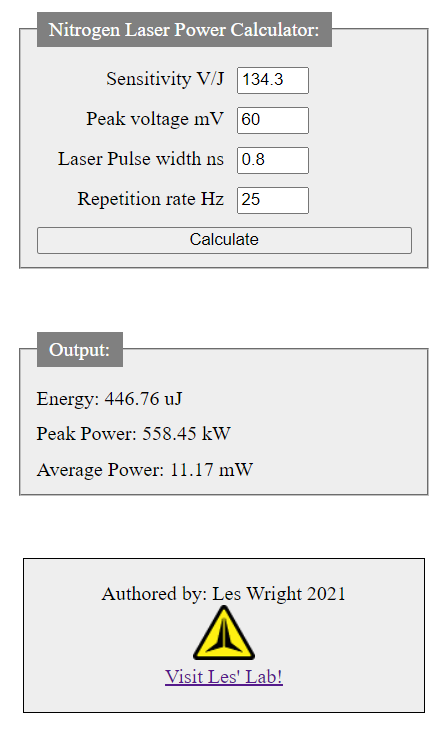

# Nitrogen_Laser_Energy_Calculator
Nitrogen Laser energy Calculator in JavaScript

Visit my Youtube Channel at: https://www.youtube.com/leslaboratory

This program and assiciated information is free for non-commercial use, but if you have gotten value from these kinds of projects and think they are worth something, please consider donating: https://paypal.me/leslaboratory?locale.x=en_GB

This is a simple Nitrogen Laser energy Calculator written in JS. 
Why JS and not Python or something? Because everyone has a web browser! Not everyone necessarily has Python installed!

Just download the HTML file in src and open with a browser.

It is designed for use with data retreived from Pyroelectric energy sensors such  as the Gentec ED-100A, and Home Made Nitrogen Lasers.

First, measure your Laser with a suitable sensor and an Oscilloscope and note the peak voltage:

Then into the form, simply enter:

The sensitivity of your detector in Volts per Joule. 

The peak voltage read off of an Oscilloscope in mV.

The pulse width of the Laser source in nanoseconds. (TEA Lasers will run at less than <800ps (0.8ns) depending on channel length)

The repetion rate of the source.

Then hit Calculate!

Screenshot below:

